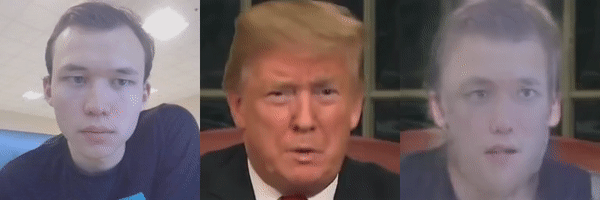

# face2face_sirius-ml
the leading software for creating deepfakes

## TODO List
Condacted Research:
- [x] First Order Motion Model for Image Animation: 
1. [paper](https://papers.nips.cc/paper/2019/file/31c0b36aef265d9221af80872ceb62f9-Paper.pdf)
2. [github](https://github.com/AliaksandrSiarohin/first-order-model)

Result:

- [x] Motion-supervised Co-Part Segmentation: 
1. [paper](https://arxiv.org/pdf/2004.03234.pdf)
2. [github](https://github.com/AliaksandrSiarohin/motion-cosegmentation)

Result: 

- [x] Few-Shot Adversarial Learning of Realistic Neural Talking Head Models: 
1. [paper](https://arxiv.org/pdf/1905.08233.pdf)\
2. [github](https://github.com/vincent-thevenin/Realistic-Neural-Talking-Head-Models)

Result:
 
